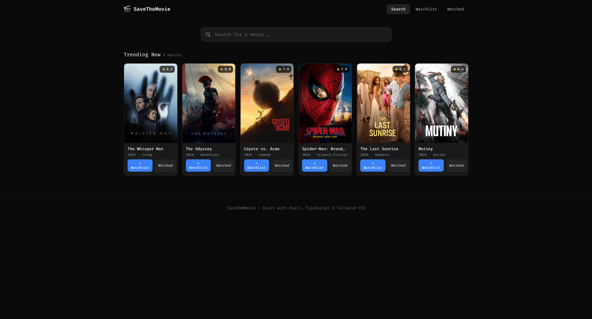

# 🎬 SaveTheMovie

A minimal, modern, self-hosted movie tracking web application built with React, TypeScript, and Tailwind CSS. Perfect for homelabs and personal movie management.



## 🏠 Homelab Ready

SaveTheMovie is designed as a **self-hosted solution** for tracking your personal movie collection. Deploy it on your homelab with Docker, run it locally, or host it anywhere you want — your data stays with you via localStorage.

**Ideal for:**
- 🏡 Homelab enthusiasts
- 🎥 Movie collectors & trackers
- 🔒 Privacy-focused users who want local data storage
- 🚀 Self-hosting advocates

## Features

- **Search** — Find movies by title using the TMDb API (or sample data)
- **Trending** — See trending movies on the homepage
- **Watchlist** — Save movies you want to watch
- **Watched** — Track movies you've already seen
- **Persistent** — Your lists are saved to localStorage (local, private data)
- **Fira Code Font** — Beautiful monospace Nerd Font
- **Dark Theme** — Easy on the eyes during late-night browsing

## Tech Stack

- React 18 + TypeScript
- Vite
- Tailwind CSS
- TMDb API (with sample data fallback)
- Docker ready
- GitHub Pages deployment

## Getting Started

```bash
# Install dependencies
npm install

# Start development server
npm run dev
```

## API Key (Optional)

The app works without an API key using sample movie data. To use real movie data:

1. Get a free API key at [TMDb](https://www.themoviedb.org/settings/api)
2. Copy `.env.example` to `.env.local`
3. Add your API key:
   ```
   VITE_TMDB_API_KEY=your_api_key_here
   ```

## 🐳 Self-Hosting with Docker

The easiest way to self-host SaveTheMovie in your homelab:

### Docker Compose (Recommended)

```bash
# Set your TMDb API key (optional - works without it)
export VITE_TMDB_API_KEY=your_api_key_here

# Or create a .env file with:
# VITE_TMDB_API_KEY=your_api_key_here

# Run with Docker Compose
docker-compose up -d

# Access at http://localhost:8080 or http://your-server-ip:8080
```

### Docker CLI

```bash
# Build with API key
docker build --build-arg VITE_TMDB_API_KEY=your_api_key_here -t savethemovie .

# Or build without API key (uses sample data)
docker build -t savethemovie .

# Run the container
docker run -d -p 8080:80 --name savethemovie savethemovie
```

**Note:** The API key is baked into the build at build-time. If you change your API key, rebuild the image.

**Features:**
- ✅ Production-optimized Nginx server
- ✅ Gzip compression enabled
- ✅ Security headers configured
- ✅ Lightweight Alpine-based image
- ✅ Auto-restart on failure

## 🏗️ Build from Source

For manual deployment or custom hosting:

```bash
# Install dependencies
npm install

# Build for production
npm run build

# The production files will be in the 'dist' folder
# Serve with any static file server (Nginx, Apache, etc.)

# Preview the build locally
npm run preview
```

## Repository

**GitHub:** https://github.com/BxtGeek/SaveTheMovie

---

## ⭐ Support

If you like SaveTheMovie, please **star the repository** to show your support!

Have suggestions or ideas for improvement? Feel free to:
- 🐛 [Open an issue](https://github.com/BxtGeek/SaveTheMovie/issues)
- 💡 Share your feedback
- 🤝 Contribute via pull requests

Your feedback helps make SaveTheMovie better for the homelab community!

## 📄 License

MIT License - feel free to use, modify, and distribute this project for personal or commercial use.

See [LICENSE](LICENSE) for details.
